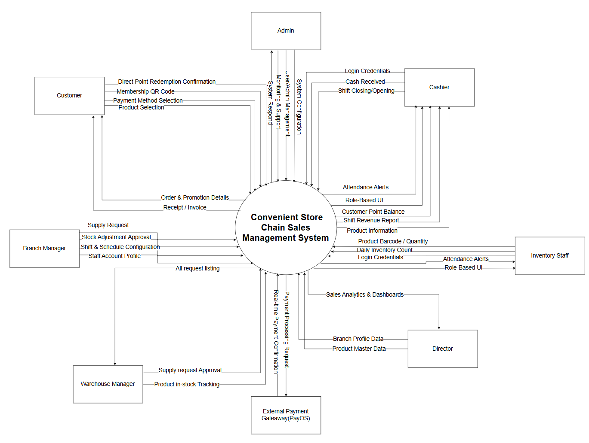
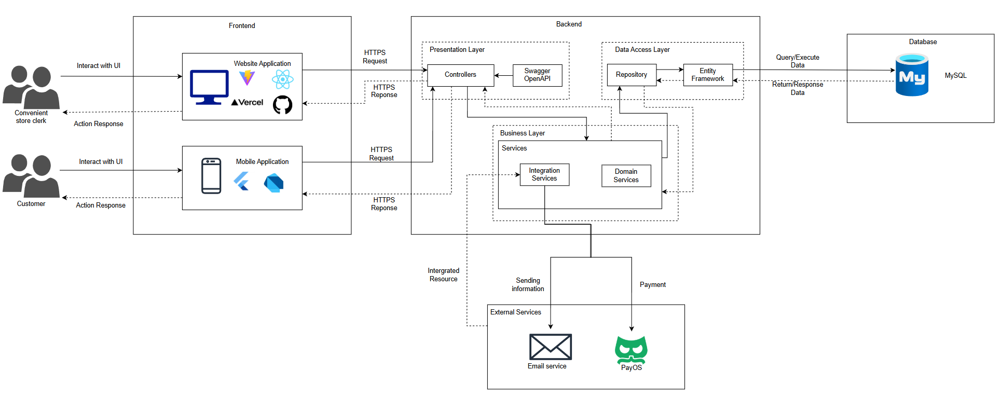
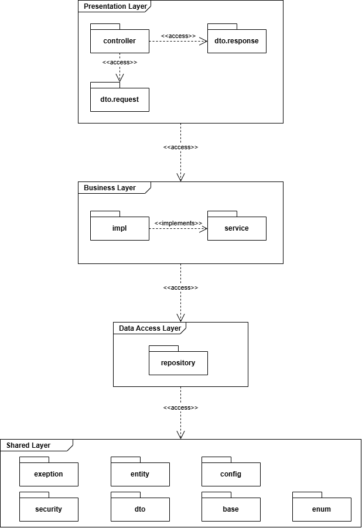
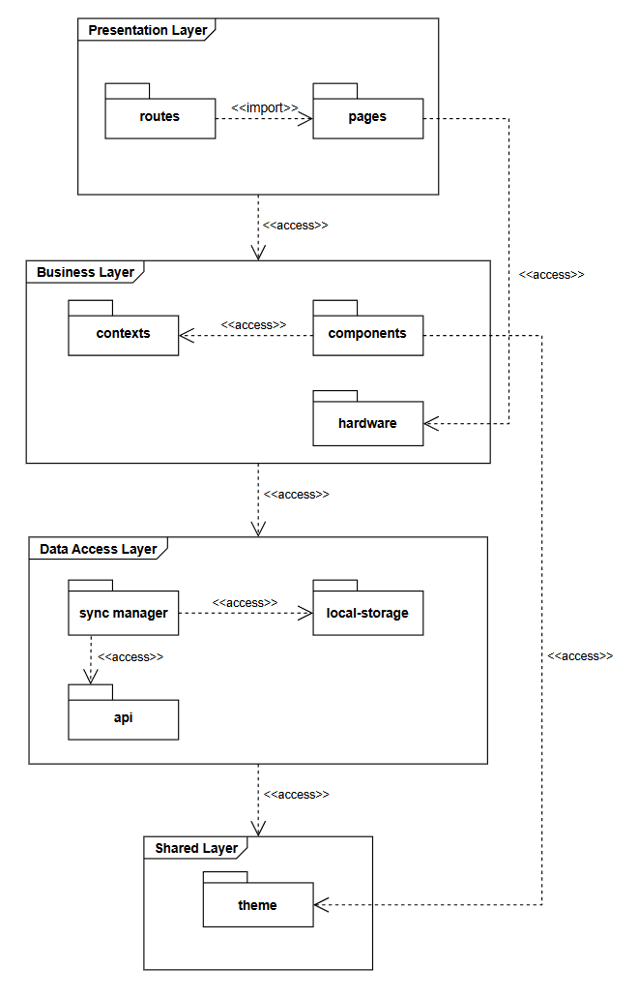
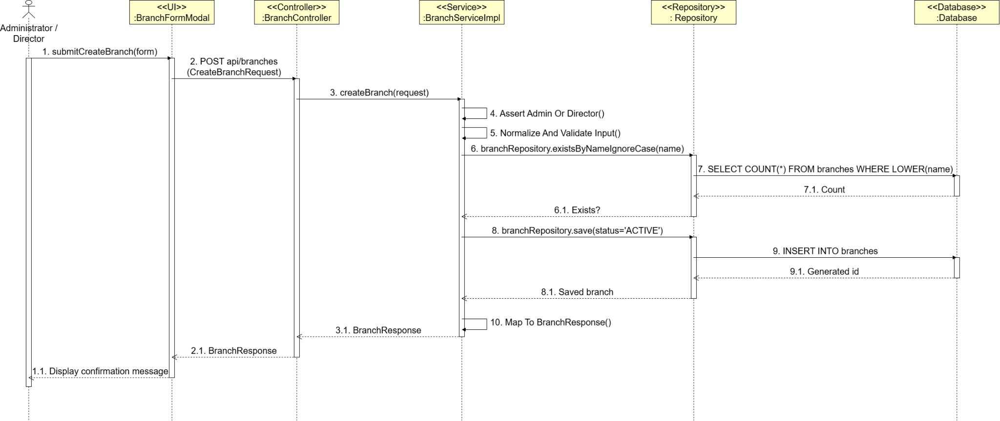

# 02 — System Architecture

Figures are taken from Report 7 (not redrawn). Full gallery: [07 — Diagrams & flows](07-diagrams-from-report7.md).

## Context

**Figure III.1.1 — System Context Diagram**

## Conceptual architecture

**Figure IV.1.1**

## Packages

**Figure IV.1.2.2 — Backend package**

**Figure IV.1.2.1.3 — POS frontend package**

## Sequence (sample)

**Figure IV.3.1.3.1 — Create Branch**

Checkout, shift, import, inventory, and report swimlanes are in [07](07-diagrams-from-report7.md).
