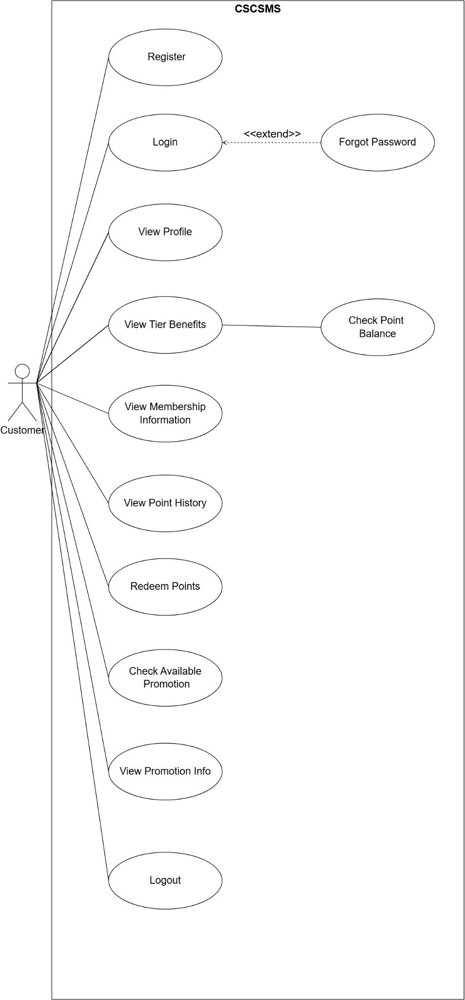
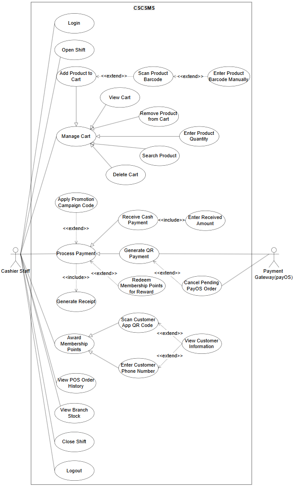
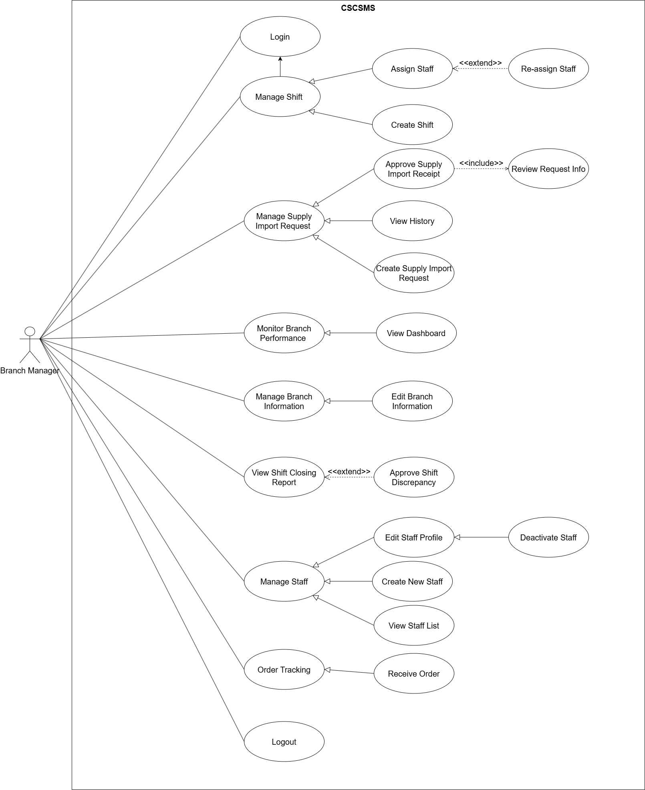
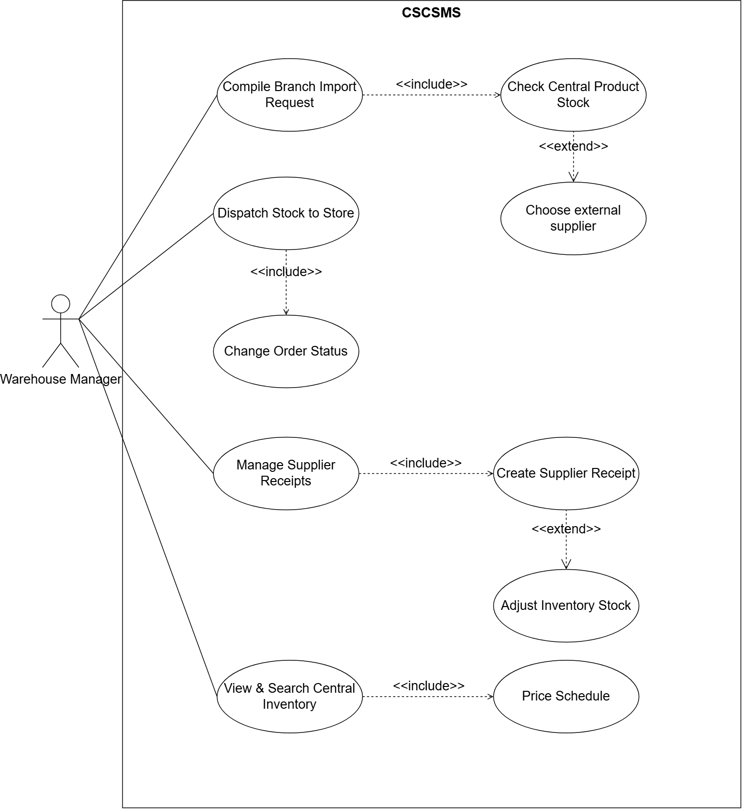
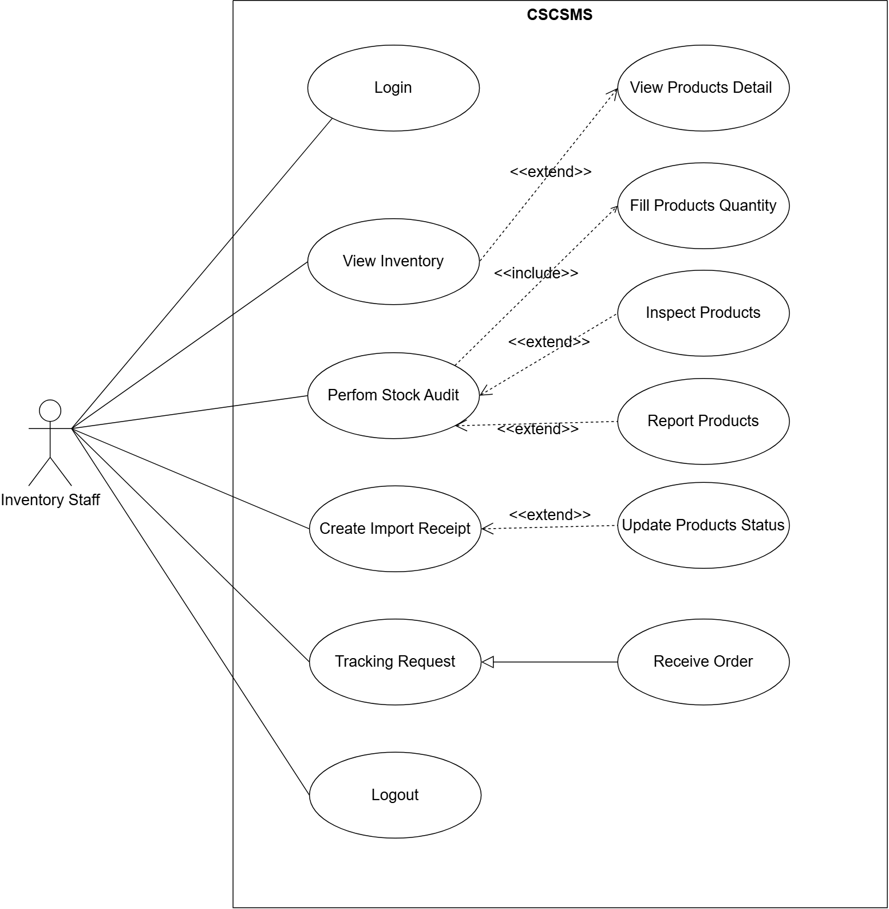
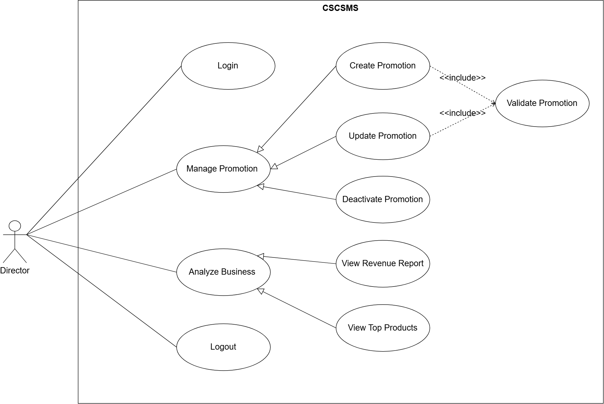
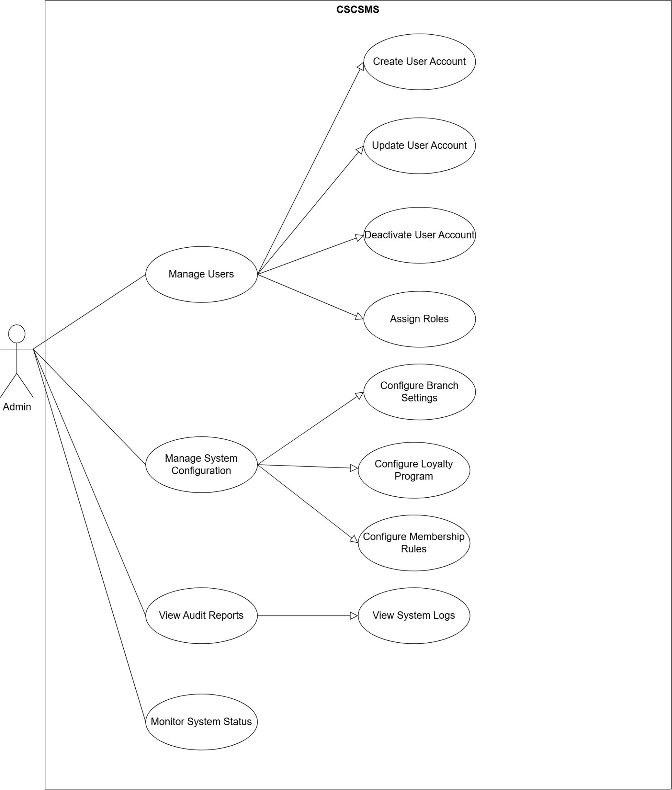
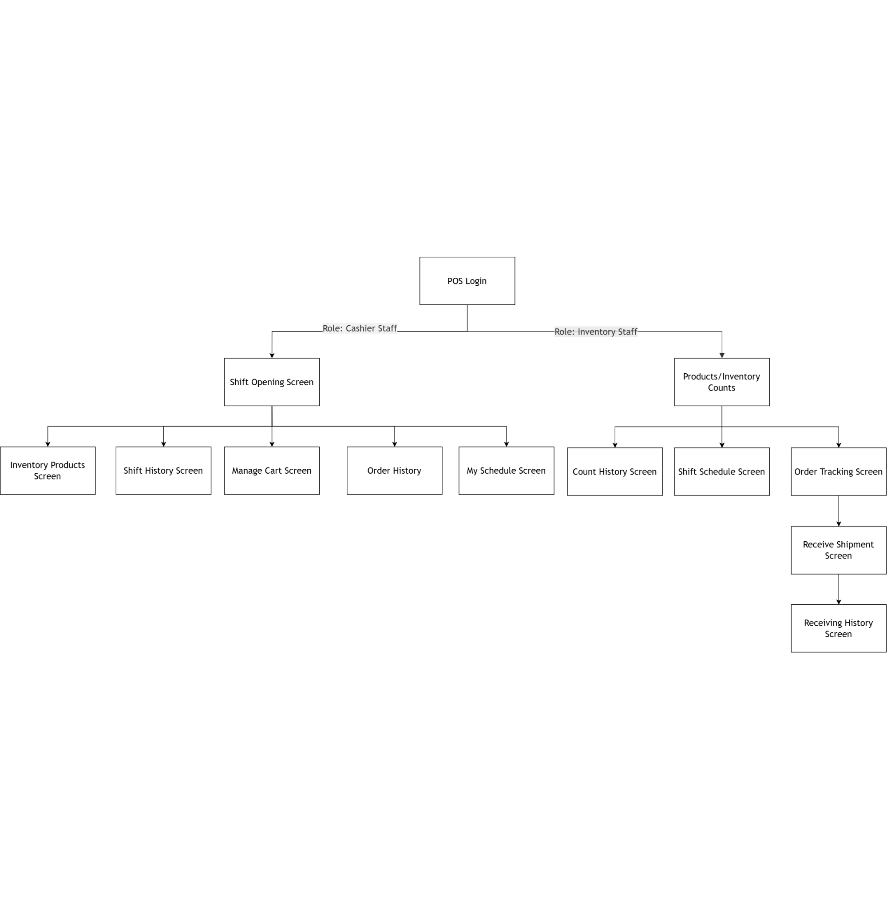
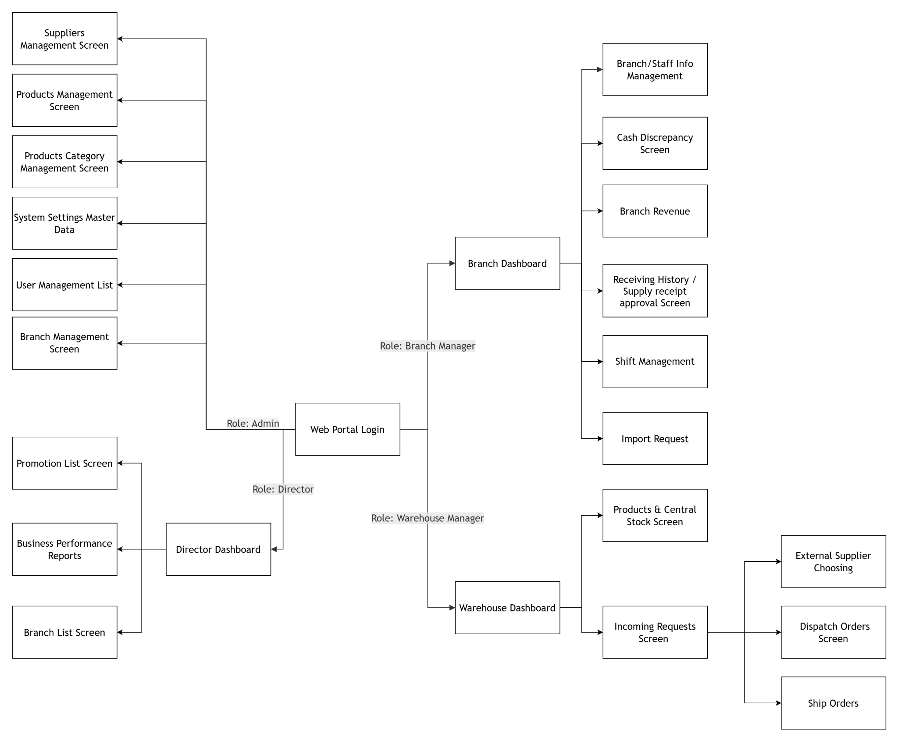
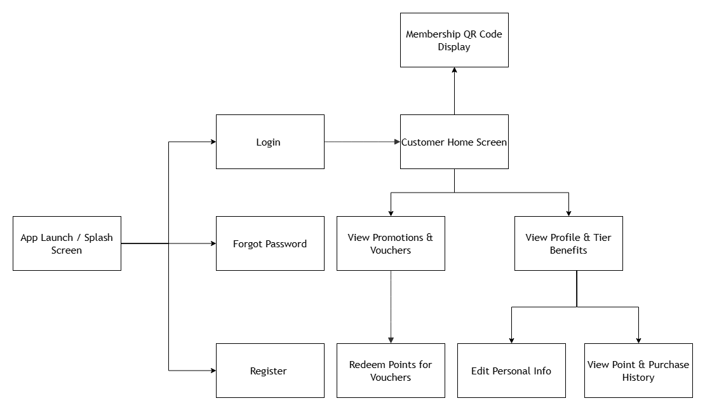

# 03 — Actors & Roles

Use case diagrams from Report 7 (Figures III.2.3.1–III.2.3.7).

## Customer

## Cashier

## Branch Manager

## Warehouse Manager

## Inventory Staff

## Director

## Admin

## Screen flows

**POS Web — Figure III.3.1.1**

**Staff system — Figure III.3.1.2**

**Customer app — Figure III.3.1.3**

