# 07 — Diagrams & flows from Report 7

All figures below are **exported from** [`source/Report7_FinalProjectReport.docx`](source/Report7_FinalProjectReport.docx). Captions keep the original Report 7 numbering. No diagrams were redrawn.

Full use-case specifications (UC-01 … UC-116), additional sequences, and test evidence remain in the Word report.

---

## Context & product

### Figure I.6.1 — Feature Diagram

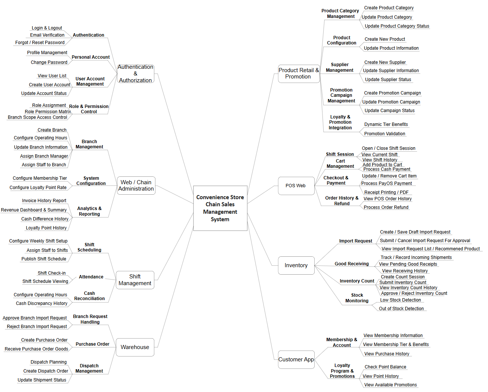

### Figure II.2.1 — Project process

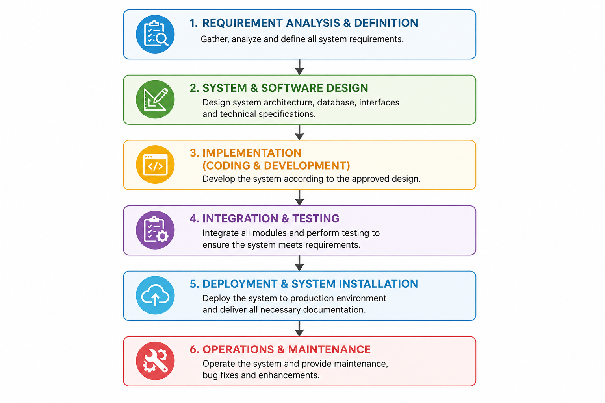

### Figure III.1.1 — System Context Diagram

---

## Main workflows (swimlanes)

### Figure III.1.2.1 — POS Sales Checkout

The swimlane is stored as four original pages from the report:

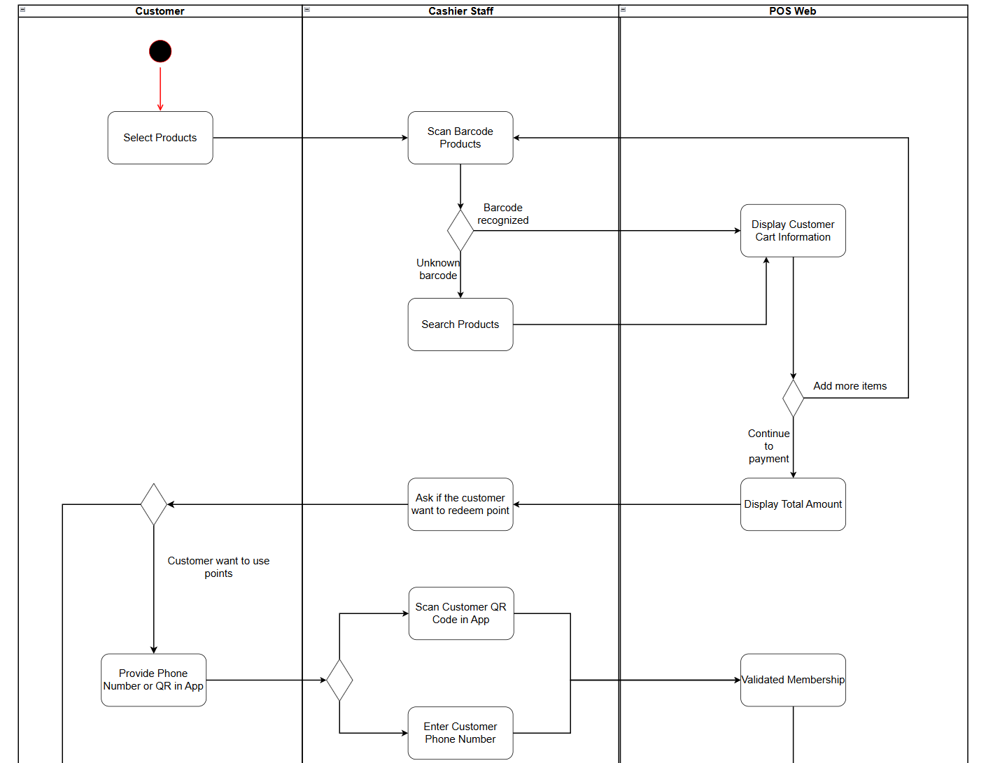
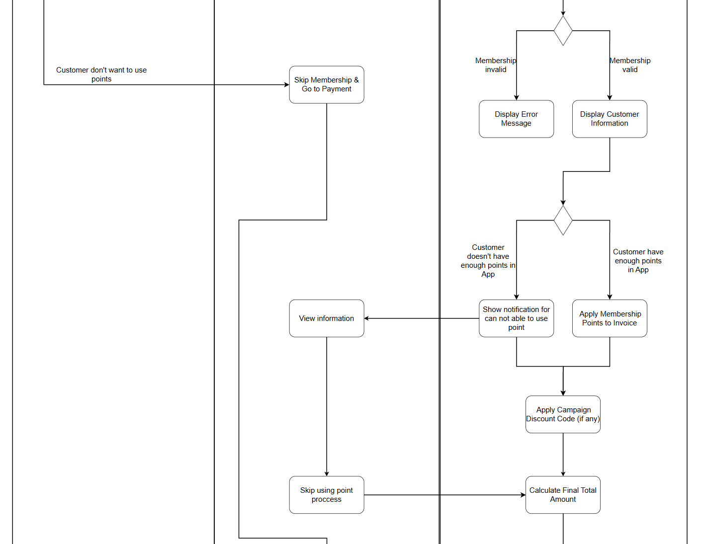
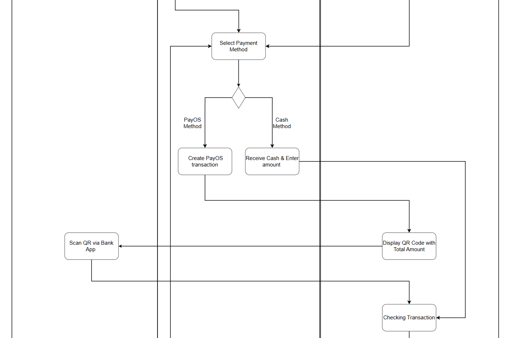
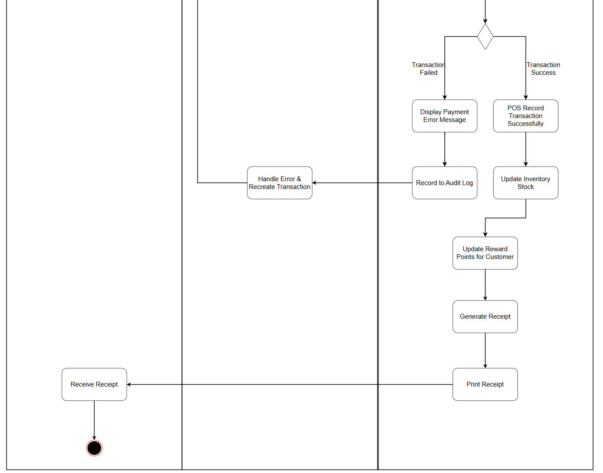

### Figure III.1.2.2 — Revenue Report

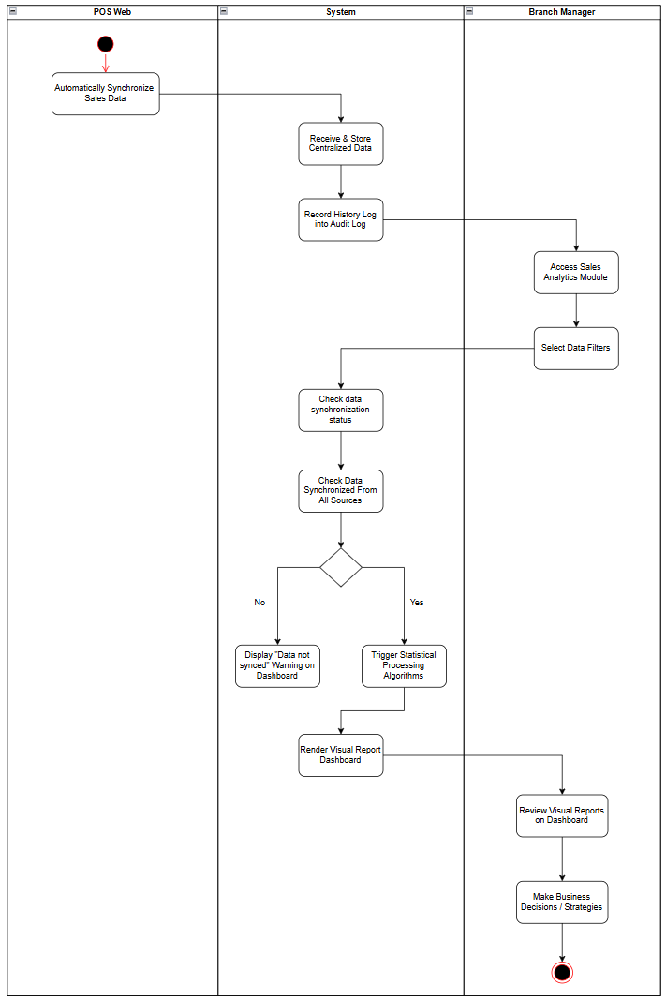

### Figure III.1.2.3 — Import Process

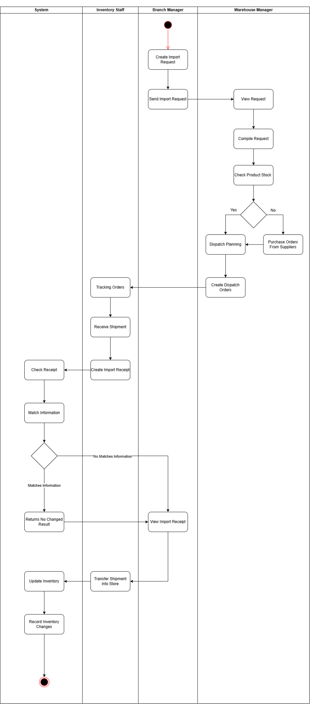

### Figure III.1.2.4 — Inventory Count

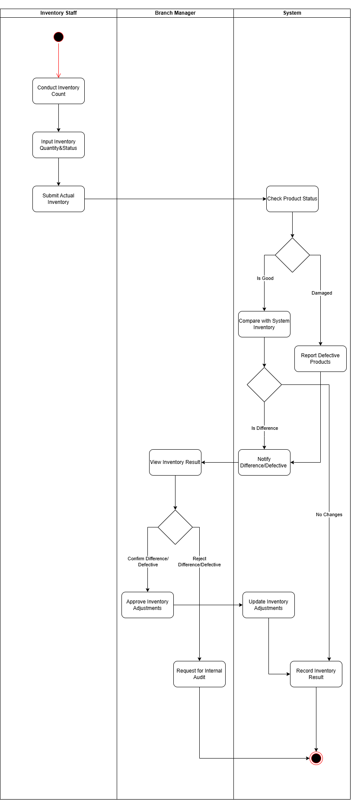

### Figure III.1.2.5 — Shift Opening

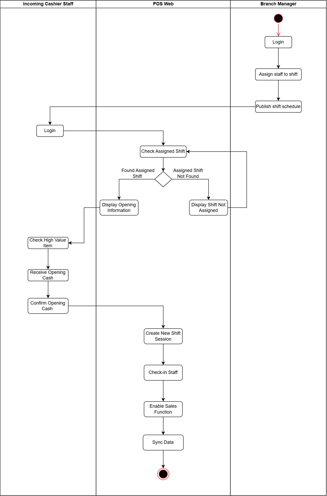

### Figure III.1.2.6 — Shift Closing

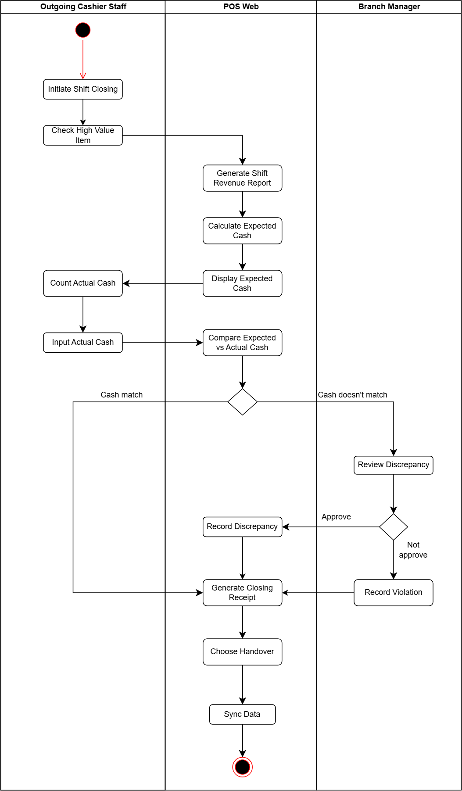

### Figure III.1.2.7 — Branch Information Management

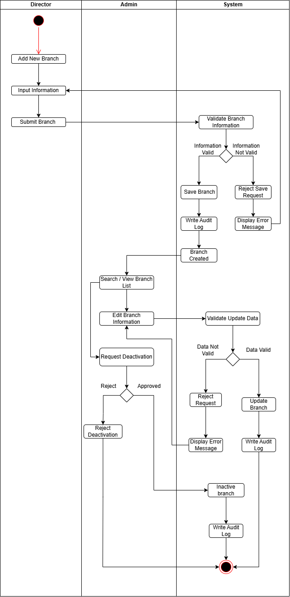

---

## Use case diagrams (by actor)

### Figure III.2.3.1 — Customer

### Figure III.2.3.2 — Cashier

### Figure III.2.3.3 — Branch Manager

### Figure III.2.3.4 — Warehouse Manager

### Figure III.2.3.5 — Inventory Staff

### Figure III.2.3.6 — Director

### Figure III.2.3.7 — Admin

---

## Screen flows

### Figure III.3.1.1 — POS Web

### Figure III.3.1.2 — Staff system

### Figure III.3.1.3 — Customer app

---

## Data & architecture

### Figure III.3.1.6 — Entity Relationship Diagram (SRS)

### Figure IV.1.1 — Conceptual architecture

### Package diagrams

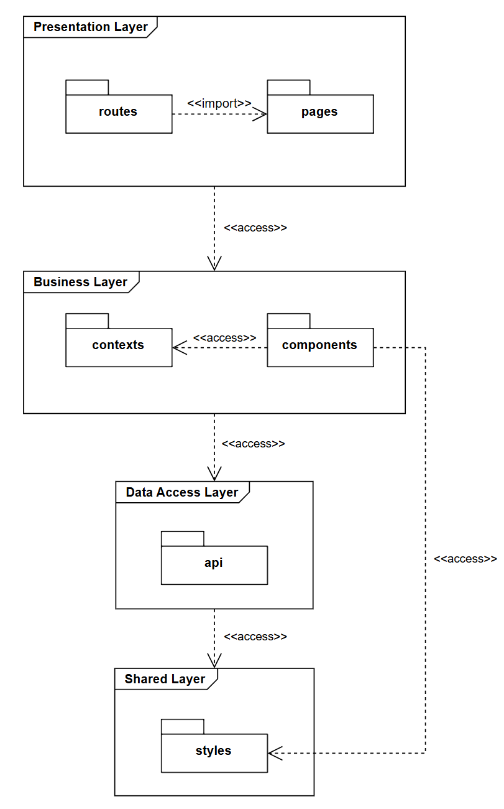

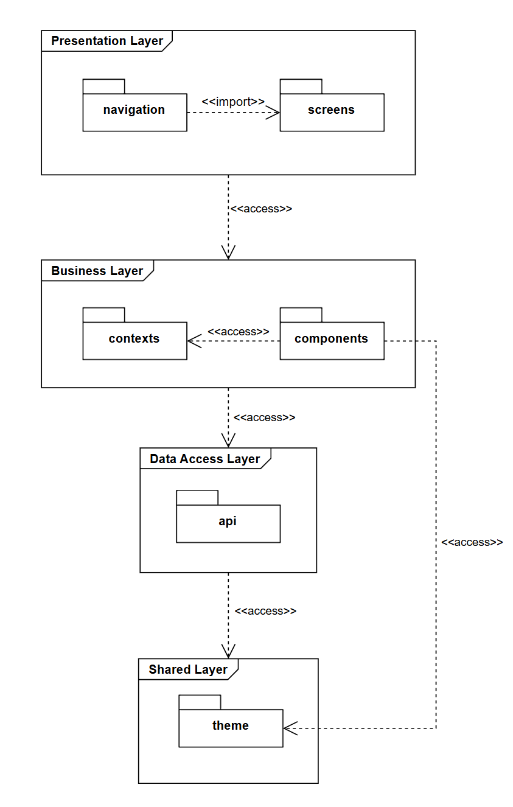

### Figure IV.1.2.1.3 — POS frontend package

### Figure IV.1.2.2 — Backend package

### Figure IV.2 — System database design

---

## Detailed design (sample)

### Figure IV.3.1.2 — Admin class diagram

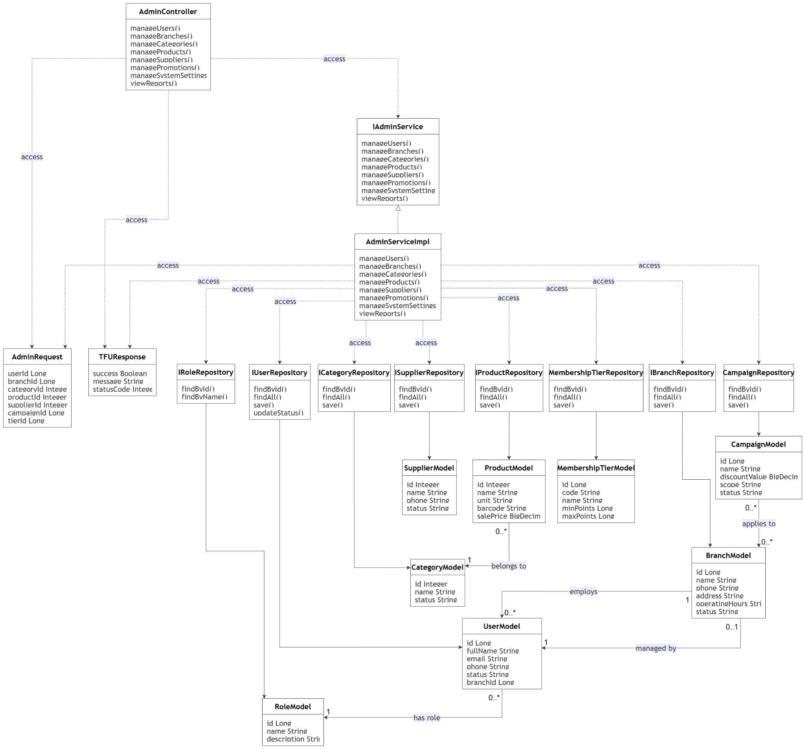

### Figure IV.3.1.3.1 — Create Branch sequence diagram

Remaining sequence diagrams and UC specification screens (III.3.2.x) are in the full Report 7 file.
